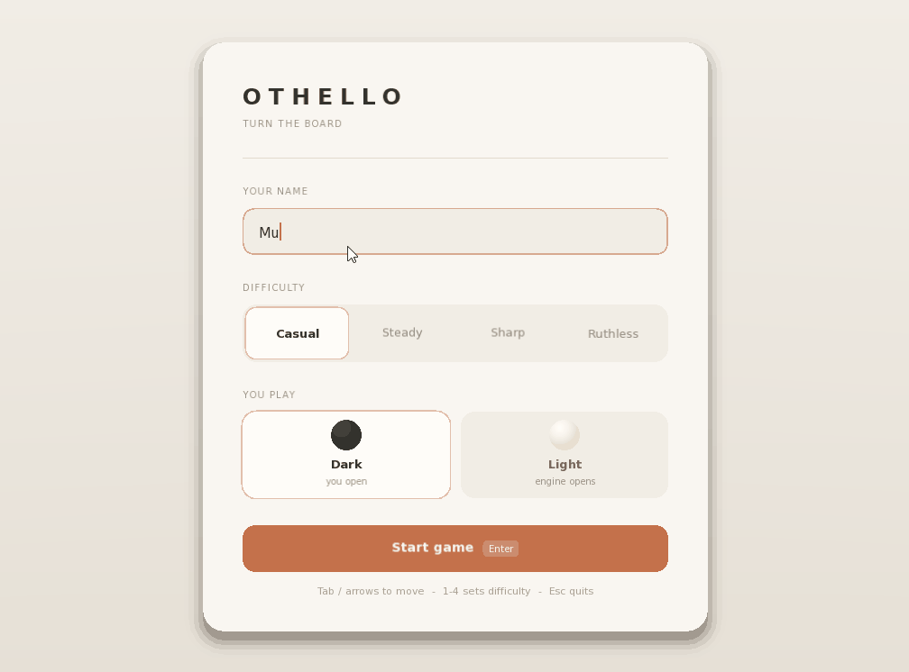

# Othello

This project develops an AI to play Othello using the Minimax algorithm with Alpha-Beta pruning. The objective is to capture as many opponent's pieces as possible. Learn the rules on [Wikipedia](https://en.wikipedia.org/wiki/Reversi).

## Interface

The game ships with an **SFML** graphical UI: choose your difficulty and piece on the setup screen, click highlighted squares to place discs, watch the AI respond, and restart from the end-of-match overlay.

  

## Download

Grab the latest build for your platform from the [Releases page](https://github.com/muhamm-ad/Othello/releases), just extract and run:

- **Windows**: extract the zip, run `Othello.exe`
- **Linux**: extract the tar.gz, run `./Othello`
- **macOS**: extract the tar.gz; the binary isn't code-signed, so the first time you'll need to right-click `Othello` → Open to get past Gatekeeper, then run `./Othello`

## Building from Source

Want to modify the code or build it yourself? See [docs/BUILDING.md](docs/BUILDING.md).

## Contributing

Contributions are welcome. Open issues or submit pull requests.

## License

This project is licensed under the [GNU General Public License V3](LICENSE).
